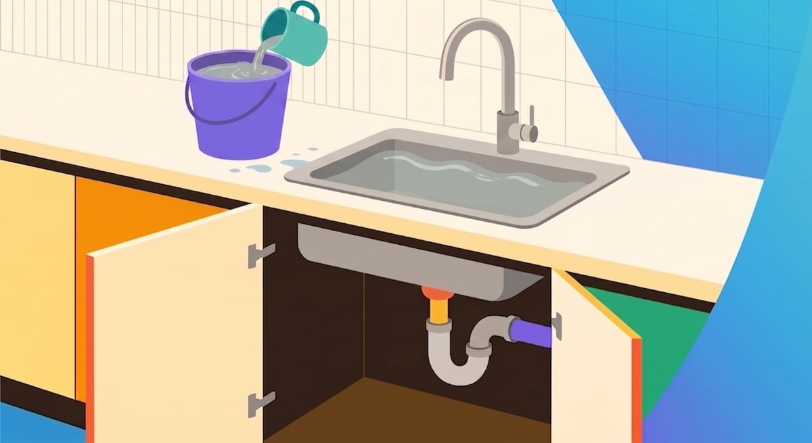
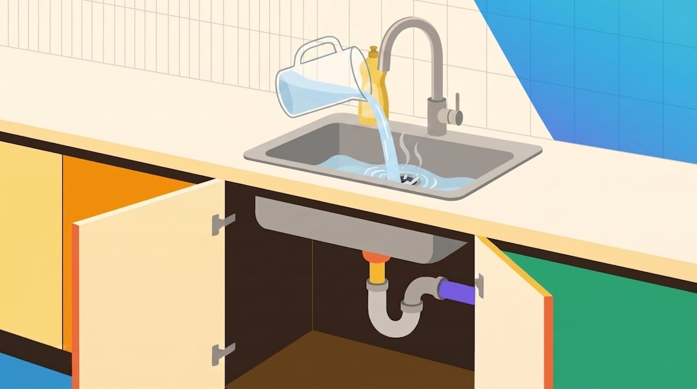
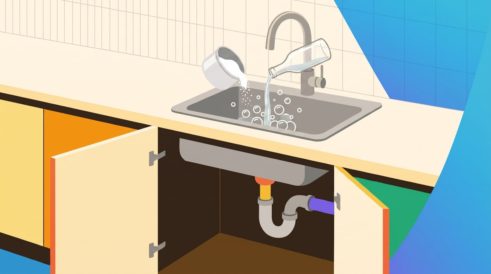
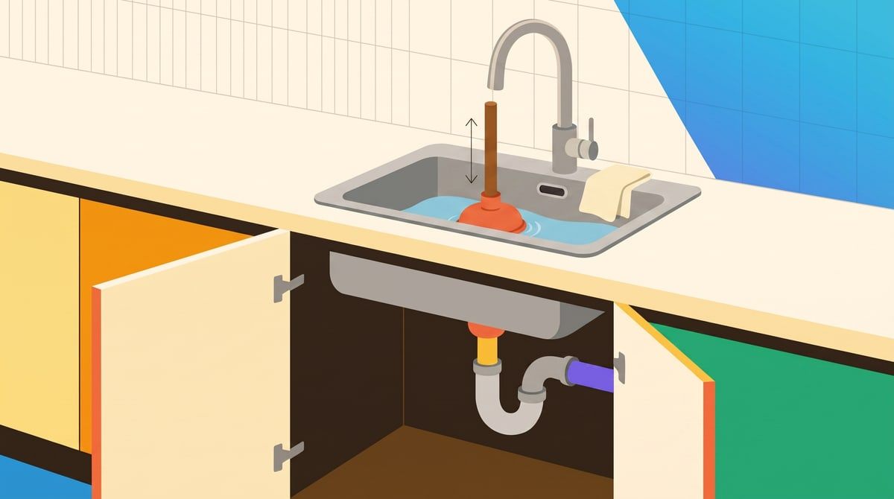
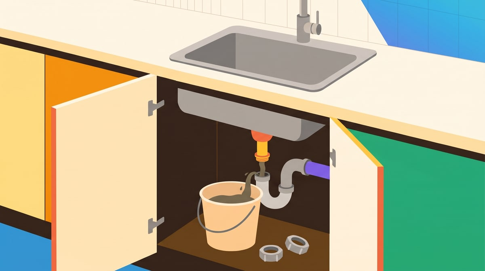
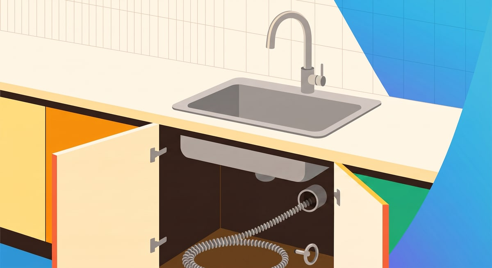

Você abre a torneira pra lavar um copo e a água fica ali, parada, girando
devagar. Meia hora depois ela desceu — mas voltou junto aquele cheirinho.
No dia seguinte a louça do jantar já não tem pra onde ir. 🧽

Antes de procurar desentupidora no Google: **entupimento de pia de cozinha é
quase sempre gordura**. Óleo de fritura, molho, restinho de comida — tudo isso
esfria dentro do cano e vira uma pasta que fecha a passagem. E gordura você
resolve em casa, sem ferramenta cara e sem chamar ninguém.

A ordem abaixo importa. Comece pelo passo 1 e só suba pro próximo se o
anterior não resolver. Pular direto pro método mais bruto é o jeito mais rápido
de transformar um entupimento simples num cano estragado.

## Antes de começar: quanto tempo e quanto custa

| Item | Estimativa |
| --- | --- |
| Tempo | 15 minutos (casos simples) a 1 hora |
| Dificuldade | Tranquila — suja um pouco a mão |
| Custo do material | Uns R$ 20 a R$ 50 |
| Serviço de desentupidora | Costuma ficar entre R$ 150 e R$ 300 |

Esses valores são só uma referência pra você ter ideia da conta, não uma tabela.
Preço de desentupidora **varia bastante com a região** — capital cobra mais que
cidade pequena — e sobe em chamado de emergência, à noite ou em feriado. No
material, o gasto depende do que você já tem em casa: quem só precisa do
desentupidor de borracha gasta pouco; a sonda do passo 6, se o caso chegar lá,
sozinha já passa dos R$ 50.

## O que você vai precisar

- **Desentupidor de borracha** — o de cozinha, aquele de boca lisa e chata (o
  de banheiro tem uma sanfona no meio e é feito pro vaso)
- **Balde ou bacia** — pra aparar a água do sifão
- **Bicarbonato de sódio e vinagre branco** — o do mercado mesmo
- **Detergente** — o que já está na pia
- **Luva de borracha** e um **pano velho**
- **Chave de grifo** — só se o seu sifão for de metal. O de plástico solta com a mão

> ⚠️ **O que não usar de cara:** soda cáustica. Ela é o primeiro conselho que
> aparece por aí e é justamente o mais perigoso — tem uma seção só sobre isso
> mais pra frente.

## Passo 1: tire a água parada

Se a cuba está cheia, esvazie antes de qualquer coisa. Use uma caneca ou um
copo e vá tirando pra um balde.

Parece etapa boba, mas nenhum dos métodos seguintes funciona com a pia cheia:
a água quente esfria no caminho, o bicarbonato dilui antes de agir e o
desentupidor só empurra água pra cima.

## Passo 2: água quente com detergente

O mais simples e o que resolve a maioria dos casos de gordura recente.

Esquente uns 2 litros de água e **desligue antes de ferver**. Se o seu sifão é
de plástico — e é, na maioria dos apartamentos —, água fervendo pode amolecer a
peça e soltar a vedação. Quente de dar respeito na mão já basta.

Espalhe um bom tanto de detergente direto no ralo, espere um minuto e despeje a
água quente devagar, em fio contínuo. O detergente quebra a gordura, a água
quente empurra.

Não desceu? Espere a pia esvaziar sozinha e vá pro passo 3.

## Passo 3: bicarbonato e vinagre

Despeje **meia xícara de bicarbonato** direto no ralo, empurrando o pó pra
dentro com o dedo ou com uma colher.

Em seguida jogue **uma xícara de vinagre branco** por cima. Vai borbulhar e
fazer barulho — é a reação normal dos dois, e é ela que ajuda a soltar a
crosta grudada na parede do cano.

Tampe o ralo com um pano e deixe agir por **20 a 30 minutos**. Depois jogue mais
água quente (de novo: quente, não fervendo).

> **Dica de quem já errou:** não jogue os dois juntos numa vasilha e depois no
> ralo. A reação acontece fora do cano e você desperdiça o efeito todo.

## Passo 4: desentupidor de borracha

Aqui tem um detalhe que muita gente pula e por isso acha que "desentupidor não
funciona":

1. Deixe **um dedo de água na cuba** — a borracha precisa estar coberta pra
   fazer vácuo. No seco, ela só chia.
2. **Tampe o ladrão** com um pano bem apertado. O ladrão é aquele furinho na
   parede da cuba, lá em cima, que evita transbordar. Se ele fica aberto, a
   pressão escapa por ali em vez de ir pro cano.
3. Se a sua pia tem **duas cubas**, tampe o outro ralo também, pela mesma razão.
4. Encaixe a borracha cobrindo o ralo inteiro e faça uns **15 movimentos firmes
   pra cima e pra baixo**, sem tirar do lugar. Só no último puxe com força.

Repita duas ou três vezes. Se a água começar a descer mais rápido a cada
tentativa, você está no caminho certo — insista.

## Passo 5: abra o sifão (é aqui que a maioria resolve)

O sifão é aquela curva em U embaixo da pia, dentro do armário. Ele existe de
propósito: a curva segura um pouco de água e é isso que impede o cheiro do
esgoto de subir. Só que essa mesma curva é onde a gordura e os restos param
primeiro.

Na prática, **é o ponto mais comum do entupimento** — e o único que você limpa
olhando.

1. Coloque o **balde embaixo** antes de tudo. Sempre. Vai cair água suja, e vai
   cair mais do que você imagina.
2. Gire as duas porcas grandes do sifão **no sentido anti-horário**. Sendo de
   plástico, saem com a mão; de metal, use a chave de grifo com jeito.
3. Retire a peça e despeje o conteúdo no balde — não na própria pia.
4. Limpe por dentro com água corrente e uma escova velha (de louça ou de dente).
   Você provavelmente vai tirar uma pasta cinza de gordura. É ela a culpada.
5. Confira o **anel de borracha** de cada porca. Se estiver ressecado ou
   rachado, leve na loja e compre igual — custa poucos reais e é o que evita
   vazamento depois.
6. Monte de volta rosqueando **com a mão** até ficar firme. Aperto de ferramenta
   com força racha a rosca do plástico.
7. Abra a torneira e observe as juntas por uns 30 segundos, com o balde ainda ali.

Se pingar, não force mais a porca: desmonte, confira se o anel está bem
assentado e monte de novo. É comum precisar de duas tentativas.

## Passo 6: sonda desentupidora

Se o sifão estava limpo e a água ainda não desce, o bloqueio está mais fundo, no
cano da parede.

A ferramenta pra isso é a **sonda** (também chamada de mola ou fita
desentupidora): um arame comprido e flexível, vendido em loja de material de
construção. Com o sifão ainda desmontado, empurre a ponta pelo cano da parede
girando devagar. Quando sentir a resistência, continue girando pra furar e
puxe de volta trazendo a sujeira.

Vá com calma. Enfiar com força pode furar um cano velho — e aí o problema muda
de tamanho.

## Sobre a soda cáustica: leia antes de usar

Soda cáustica desentope, sim. E é o conselho que mais aparece na internet — em
geral escrito por quem não vai estar lá se der errado.

Ela é uma substância corrosiva de verdade: **queima a pele em segundos**,
esquenta sozinha ao encostar na água e solta um vapor que arde nos olhos e na
garganta.

Se ainda assim você for usar, essas regras não são opcionais:

- **Luva de borracha, óculos de proteção e janela aberta.** Sem exceção.
- **Nunca depois de outro produto químico** ter descido pelo ralo. A mistura
  pode liberar gás tóxico.
- **Nunca com o desentupidor de borracha.** Se a água não descer, a soda fica
  parada na cuba — e o desentupidor respinga esse líquido no seu rosto.
- **Nunca em cano de PVC antigo ou com vazamento conhecido.**
- Sempre **jogar a soda na água**, nunca água sobre a soda.

Sinceramente? Nos cinco passos acima você resolve praticamente todo entupimento
de cozinha sem correr nenhum desses riscos. A soda é atalho com pedágio caro.

## Quando parar e chamar um profissional

Chame um encanador se você encontrar:

- Água voltando **em outro ponto da casa** (ralo do banheiro, tanque, vaso)
  quando você usa a pia — sinal de que o entupimento é da coluna do prédio, não
  da sua pia
- Cheiro forte de esgoto mesmo com o sifão limpo e cheio de água
- Cano de metal antigo, enferrujado ou que já vaza
- A pia entupindo de novo poucos dias depois de você limpar

E se você **mora de aluguel**: entupimento na coluna do prédio costuma ser
responsabilidade do condomínio ou do proprietário, não sua. Antes de pagar
desentupidora do próprio bolso, fale com a administração ou com quem te alugou o
imóvel.

## A dica extra: o que faz não entupir de novo

- **Óleo usado nunca vai pro ralo.** Guarde numa garrafa PET fechada e leve num
  ponto de coleta — muitos mercados recebem. Esse único hábito responde pela
  maior parte dos entupimentos de cozinha.
- **Passe papel-toalha na louça engordurada** antes de lavar. Frigideira e
  travessa de assado, principalmente.
- **Use uma telinha protetora no ralo.** Custa quase nada e segura os restos que
  passam pela grade.
- **Uma vez por semana**, mande água quente com detergente pelo ralo antes de
  dormir. São dois minutos que evitam a tarde inteira de balde e sifão.

---

**Resumo rápido:** esvazie a cuba, água quente com detergente, bicarbonato e
vinagre, desentupidor com o ladrão tampado e — se nada disso resolver — abra o
sifão, que é onde a gordura quase sempre está. Sonda só depois disso. Soda
cáustica, de preferência, nunca.

