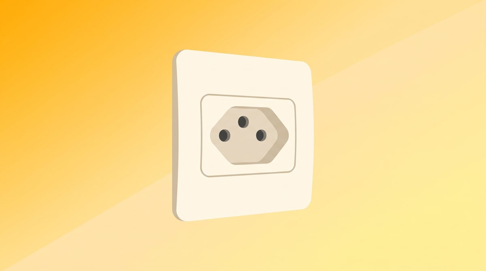
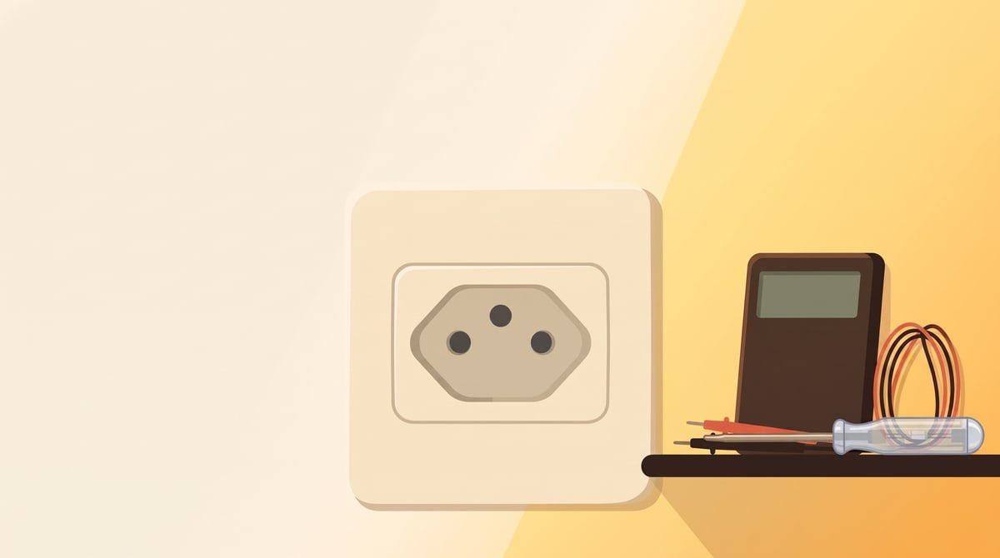
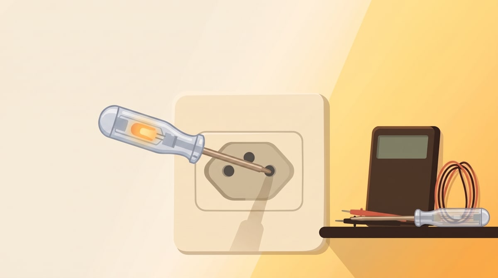
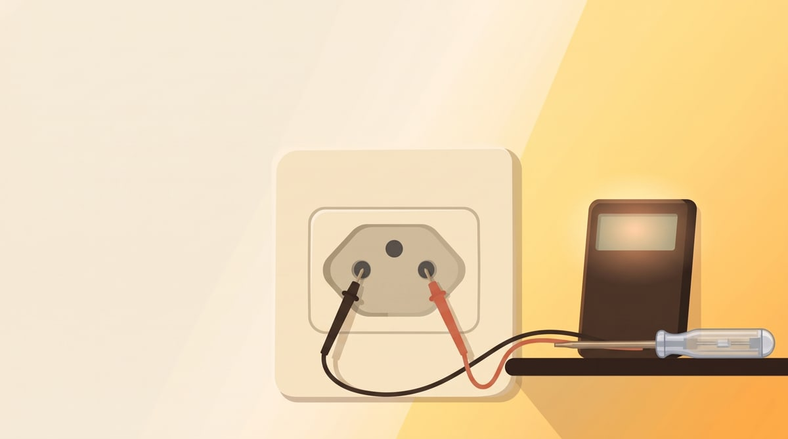

Antes de trocar uma tomada, instalar um ventilador de teto ou simplesmente entender por que um aparelho não liga, existe uma pergunta que separa quem mexe em elétrica com segurança de quem está confiando na sorte: **qual desses fios é a fase, qual é o neutro e qual é o terra?**

A boa notícia é que dá para responder essa pergunta com duas ferramentas baratas e fáceis de achar: a **chave de teste** (aquela chave de fenda com lâmpada neon no cabo) e o **multímetro**. A notícia que importa mais ainda é que isso é elétrica de verdade — envolve risco de choque — e precisa ser feito com respeito, segurança e capricho, não de "qualquer jeito"!

⚠️ **Antes de continuar**: se em algum momento você não tiver certeza do que está fazendo, sentir insegurança com o quadro de disjuntores ou encontrar fiação em mau estado (fios descascados, quadro sem identificação, cheiro de queimado), pare e chame um eletricista. Este texto ensina a *identificar* fios com segurança básica — não substitui uma instalação revisada por profissional.

## Resposta rápida: o que é cada fio

- **Fase** — é o fio "vivo", o que traz a corrente elétrica. Encostar nele fecha o circuito através do seu corpo se você também estiver em contato com algo aterrado (o chão, uma estrutura metálica). É o fio que dá choque.
- **Neutro** — fecha o circuito de volta à rede. Em condições normais tem tensão próxima de zero em relação à terra, mas **não é seguro assumir que ele nunca tem tensão** — em instalações com problema, ele pode estar "energizado" também.
- **Terra** — não conduz corrente em uso normal. Existe para escoar energia com segurança em caso de falha (um curto, um vazamento de corrente), evitando que a carcaça de um aparelho fique energizada.

Na tomada padrão brasileira (NBR 14136), a posição costuma seguir um padrão de instalação, mas **posição não é garantia** — instalações antigas, gambiarras ou inversões de fiação acontecem. É por isso que se testa, em vez de supor pela posição do pino.

## Ferramentas: o que cada uma faz (e o que não faz)

### Chave de teste (chave neon)

É a ferramenta de triagem rápida. Tem uma lâmpada neon no cabo transparente e, geralmente, um resistor interno que limita a corrente que passa pelo seu corpo até um nível considerado seguro para esse uso específico.

- Encostando a ponta metálica num condutor **fase** e o dedo no contato metálico do cabo (fechando o circuito através do seu corpo, com a corrente limitada pelo resistor), a lâmpada acende.
- Encostando num condutor **neutro** ou **terra** em condições normais, a lâmpada não acende.

A chave de teste **não diferencia neutro de terra** — ela só indica "tem fase aqui" ou "não tem". Para separar neutro de terra com confiança, o multímetro é a ferramenta certa.

### Multímetro

Mede tensão (voltagem) entre dois pontos, entre outras funções. É mais preciso e permite confirmar o que a chave de teste só sugere.

Para testar tensão em corrente alternada (rede residencial):

1. Selecione a função de **tensão AC** (geralmente marcada como `V~` ou `ACV`), numa faixa acima de 220V — normalmente a faixa de 200V ou 750V, dependendo do modelo.
2. Encoste uma ponta de prova em cada ponto que quer comparar.
3. Leia o valor no visor.

O multímetro permite três medições que, juntas, identificam os três condutores:

- **Fase × Terra** → deve indicar a tensão da rede (no Brasil, tipicamente 127V ou 220V, dependendo da instalação).
- **Fase × Neutro** → também deve indicar tensão próxima da rede.
- **Neutro × Terra** → deve indicar um valor bem baixo, próximo de zero. Se aparecer uma tensão relevante aqui, é sinal de problema na instalação (neutro mal conectado, por exemplo) — não é situação normal.

## Passo a passo: identificando os fios com segurança

### 1. Prepare o ambiente antes de tocar em qualquer fio

- Use calçado fechado e seco, evite piso molhado.
- Se possível, trabalhe com uma mão só encostando no circuito por vez (a chamada "técnica de uma mão"), mantendo a outra mão longe de qualquer superfície aterrada. Isso reduz a chance de a corrente atravessar o peito caso algo dê errado.
- Confira se a chave de teste e o multímetro estão em bom estado: cabo sem rachadura, ponteiras firmes, nada de fio exposto.

### 2. Teste primeiro com a chave de teste

- Encoste a ponta da chave em cada fio ou terminal, com o dedo tocando o contato metálico do cabo.
- O fio que acende a lâmpada é a **fase**.
- Os que não acendem são **neutro ou terra** — ainda não dá para saber qual é qual só com a chave.

### 3. Confirme e diferencie com o multímetro

- Com o multímetro em tensão AC, meça entre o fio que você já identificou como fase e cada um dos outros dois.
- Ambos devem mostrar tensão próxima da rede — isso só confirma que a fase está correta, não diferencia neutro de terra.
- Agora meça entre os dois fios restantes (os que não acenderam a chave). O par que mostrar tensão praticamente zero entre si tende a ser **neutro e terra** — mas isso sozinho não diz qual é qual.
- Para separar neutro de terra com mais segurança, o caminho mais confiável é a **continuidade com o barramento de terra do quadro de disjuntores** (o terra da instalação deve ter continuidade com esse barramento; o neutro, não). Esse teste envolve abrir o quadro elétrico — se você não tem prática nisso, essa etapa é para o eletricista, não para o teste caseiro.

### 4. Sempre teste a ferramenta antes e depois

Um multímetro com pilha fraca ou chave de teste com lâmpada queimada pode te dar uma leitura de "sem tensão" que na verdade é falha do instrumento, não do circuito. Antes de confiar num resultado de "não tem fase aqui", teste a ferramenta numa tomada que você sabe que tem energia. Repita o teste depois de terminar, para confirmar que a ferramenta continuou funcionando o tempo todo.

## Erros comuns

- **Confiar só na posição do pino da tomada.** Instalação errada existe, e é mais comum do que parece em casas mais antigas.
- **Assumir que neutro nunca tem tensão.** Em instalação com neutro mal dimensionado ou rompido em algum ponto do circuito, ele pode apresentar tensão perigosa.
- **Usar a chave de teste como se ela também identificasse terra.** Ela não faz isso — serve só para achar a fase.
- **Testar com o disjuntor geral ligado sem necessidade.** Se o objetivo é só identificar os fios para depois trabalhar neles (trocar uma tomada, por exemplo), desligue o disjuntor do circuito depois de identificar os fios, e faça o resto do serviço sem energia.

## Quando parar e chamar um eletricista

Chame um profissional se:

- o quadro de disjuntores não tem identificação dos circuitos e você precisaria abri-lo para investigar;
- o teste de neutro × terra no multímetro mostrar tensão relevante, indicando problema na instalação;
- há fiação com isolamento rompido, emenda malfeita ou cheiro de queimado;
- o serviço depois de identificar os fios envolve mexer no quadro de distribuição ou em qualquer ponto anterior ao disjuntor do circuito.

Identificar fase, neutro e terra é conhecimento útil para entender sua instalação e trabalhar com mais segurança — não é sinal verde para qualquer intervenção elétrica.

## Dúvidas comuns

**A chave de teste "sente" choque, ou é só a lâmpada que acende?**
A lâmpada acende porque uma corrente pequena, limitada pelo resistor interno, passa pelo circuito fechado através do seu corpo até o terra (o chão, por exemplo). É por isso que a chave de teste tem uso limitado a triagem rápida — não é um equipamento de medição de precisão nem elimina o risco de choque.

**Multímetro digital ou analógico faz diferença aqui?**
Para esse tipo de teste, o digital é mais prático: leitura direta em número, menos chance de erro de interpretação. O analógico funciona, mas exige mais familiaridade com a escala.

**Posso usar só o multímetro e pular a chave de teste?**
Pode. A chave de teste é só um jeito rápido de triagem antes de confirmar com o multímetro — quem já tem prática costuma pular direto para o multímetro.

Se o motivo de você estar identificando os fios é um chuveiro elétrico que parou de esquentar, vale a pena ver também o que checar antes de trocar o chuveiro inteiro — várias das verificações ali partem exatamente desse mesmo diagnóstico de fiação.
