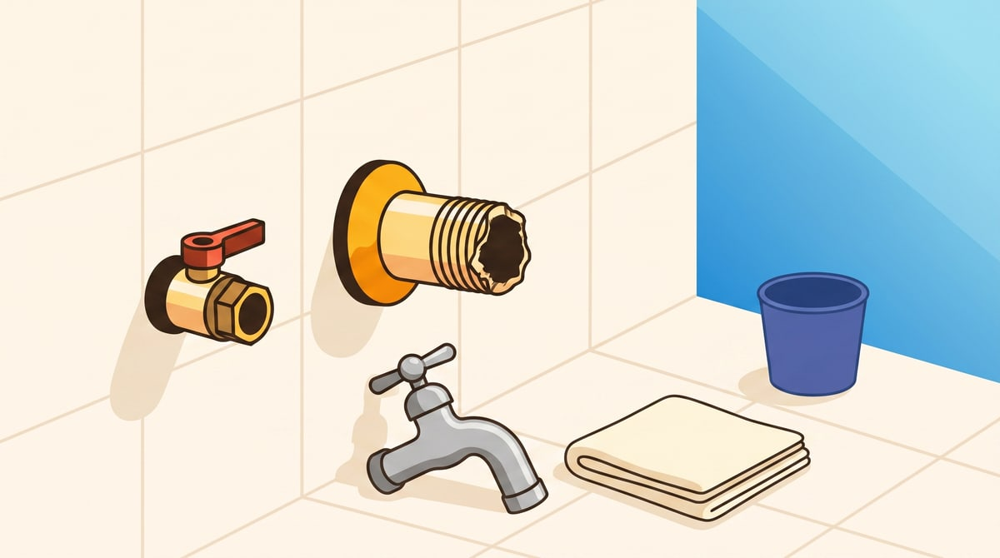
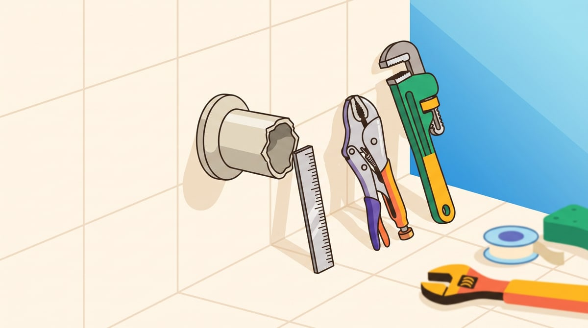
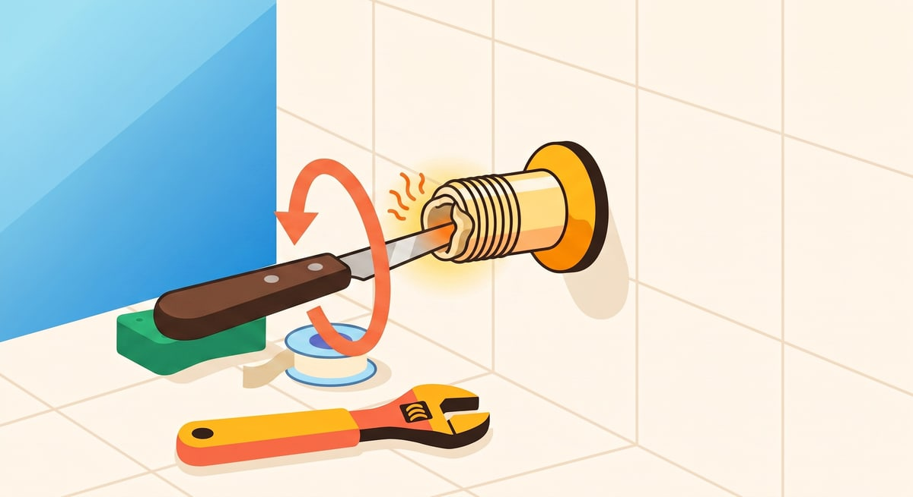
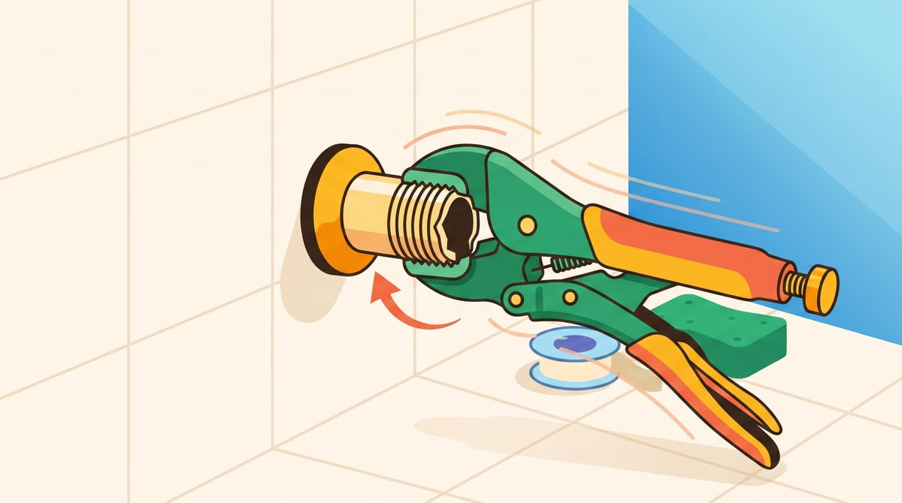
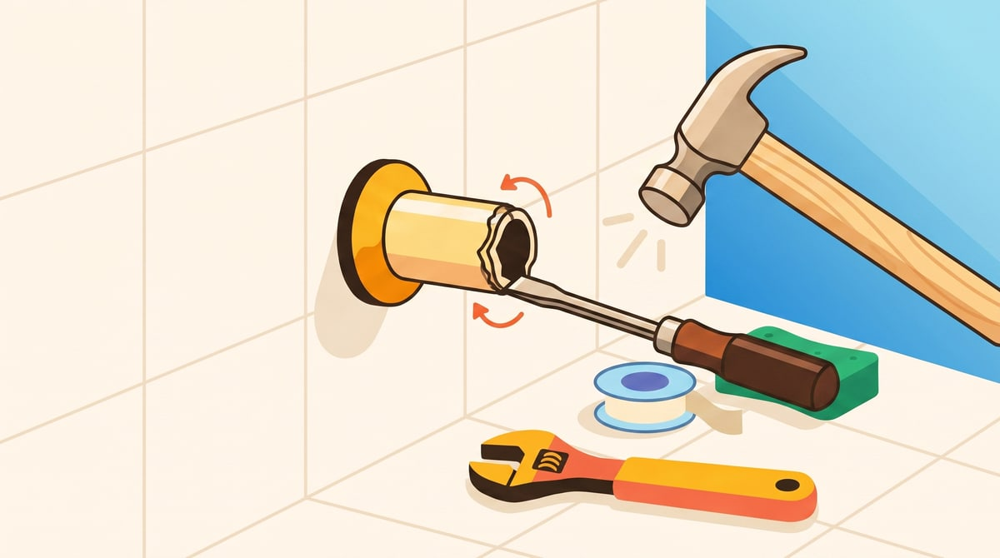
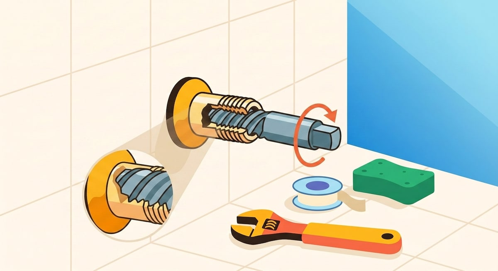

Você foi só ajeitar a torneira, ela cedeu, e agora sobrou um toco de cano rosqueado cravado na parede. Nem parece que dá pra tirar aquilo sem quebrar mais coisa — e é exatamente aí que a maioria trava. 🚿

Calma. Esse pedaço de cano é mais fácil de resolver do que parece, **desde que você não saia puxando com o primeiro alicate que encontrar**. É aí que o estrago cresce: a peça gira inteira dentro da parede, o revestimento racha ao redor, e o que era um conserto de torneira vira reforma de azulejo.

Neste post você vai pelo caminho seguro: do jeito mais simples pro mais cuidadoso, na ordem certa. Se seu cano for de plástico — caso da maioria das casas — com sorte resolve rapidinho logo no primeiro método.

## Por que não é só "puxar com força"

O cano que sobrou está rosqueado — ou seja, preso por uma rosca em espiral, igual tampa de garrafa. Ele não sai reto pra fora: sai **girando**, no sentido anti-horário.

Se você prende num alicate comum e força, duas coisas acontecem:

1. O alicate escorrega e arredonda as bordas do cano, tornando tudo mais difícil.
2. Se ele segurar firme e você forçar demais, a base inteira da conexão gira dentro da parede — e é isso que fissura o azulejo ao redor.

A saída é girar **devagar, com ferramenta que morde de verdade, e prestando atenção em qualquer sinal de que a parede está se mexendo junto**. Se sentir isso, pare na hora.

## O que você vai precisar

- **Uma faca velha** — pra esquentar e usar no método do cano de plástico
- **Alicate de pressão (aquele tipo "grip", que trava a mordida)** ou **chave de grifo**
- **Óleo desengripante** (tipo WD-40) — amolece a ferrugem que gruda a rosca
- **Talhadeira pequena e martelo** — só se o cano estiver rente à parede
- **Extrator de macho quebrado** — ferramenta específica e barata, pra casos mais difíceis
- **Pano e balde** — sempre sobra um pouco de água na tubulação
- **Fita veda-rosca** — vai precisar dela na hora de instalar a torneira nova

## Passo 1: feche o registro

Antes de qualquer coisa, feche o registro daquele ponto (geralmente embaixo da pia) ou o registro geral, se não achar. Abra a torneira que sobrou pra confirmar que não vem mais água — pode sair um fiozinho, é só o resto que ficou no cano.

Seque bem a área com o pano. Trabalhar em rosca molhada é pedir pra escorregar.

## Passo 2: veja o material do cano e quanto sobra pra fora

Isso decide qual dos métodos abaixo usar:

- **É cano de plástico (PVC)?** É o caso da maioria das casas hoje — vá pro Passo 3, costuma ser o mais rápido.
- **É metal e sobra um pedacinho, mesmo pequeno?** Vá pro Passo 4.
- **É metal e está rente à parede, sem nada pra segurar?** Pule pro Passo 5.

## Passo 3: se o cano é de plástico

Esse é o método que mais aparece em vídeo de quem já resolveu isso em casa, e funciona bem porque a maioria da tubulação residencial hoje é de PVC.

Pegue uma faca com lâmina fina o bastante pra entrar dentro do pedaço de cano quebrado. Esquente a ponta dela no fogão e encaixe dentro do cano, pressionando com firmeza pra ela se prender no plástico amolecido. Espere esfriar um pouco, ainda com a faca no lugar, e então gire no sentido anti-horário — o plástico solidifica em volta da lâmina e traz a rosca quebrada junto.

Cuidado com a lâmina quente: segure pelo cabo e não encoste em nada além do cano.

Se não funcionar de primeira ou o seu cano for de metal, siga para os próximos passos.

## Passo 4: se sobra um pedaço pra segurar

Borrife o óleo desengripante na rosca e espere uns 5 minutos — esse tempo já ajuda mais do que qualquer força extra.

Encaixe o alicate de pressão (ou a chave de grifo) bem rente à parede, trave a mordida e gire em **movimentos curtos no sentido anti-horário**. Nada de girar de uma vez só: gire um pouco, solte, reposicione, gire de novo.

Se notar a peça começando a andar, continue no mesmo ritmo até sair inteira. Costuma resolver em menos de 10 minutos.

## Passo 5: se está rente à parede, sem nada pra segurar

Aqui entra a talhadeira. Encoste a ponta dela na borda do cano — não na parede, no metal mesmo — num ângulo levemente inclinado, e dê batidas leves com o martelo, sempre "empurrando" na direção anti-horária, como se estivesse abrindo uma rosca.

A ideia não é arrancar de uma martelada: é fazer o cano "andar" alguns milímetros por vez, batida a batida, até sobrar rosca suficiente pra você trocar pra ferramenta do Passo 4 e terminar de girar com o alicate.

## Passo 6: se nada disso soltar, use o extrator

Quando a rosca está muito grudada ou enferrujada, existe uma ferramenta feita exatamente pra isso: o **extrator de macho quebrado**, vendido em qualquer loja de material de construção.

O uso costuma ser: fazer um furo no centro do cano com uma furadeira, encaixar o extrator nesse furo e girar — ele morde por dentro e traz a peça pra fora. Se você nunca usou uma furadeira antes, esse é um bom momento para pedir uma mão de alguém com mais prática, ou chamar um encanador só pra essa etapa — o resto da casa você já vai saber fazer sozinho.

## Depois que o cano saiu

Limpe bem a rosca que ficou na parede com o pano, tirando resíduos de fita veda-rosca velha e sujeira. Rosca limpa é metade do caminho pra torneira nova não vazar.

E já que o cano está livre, esse é o momento de trocar a torneira de vez — [o passo a passo completo está aqui](/posts/como-trocar-uma-torneira-que-esta-pingando), com o mesmo jeito direto de explicar.

## Quando chamar um profissional

Vale parar e chamar ajuda se:

- A parede ao redor já rachou ou o azulejo se soltou durante a tentativa
- O cano continua girando e nada dele sai, mesmo depois do extrator
- Você não tem certeza se aquele cano é de água ou de gás — na dúvida, **não mexa** e chame um profissional habilitado antes de qualquer ferramenta
- A tubulação parece muito antiga, enferrujada por dentro ou frágil ao toque

Forçar um cano que não cede raramente termina bem, e o conserto de parede sai bem mais caro que uma visita de encanador.

---

**Resumo rápido:** feche o registro e veja o material do cano — se for plástico, a faca quente resolve rápido; se for metal, segure com alicate de pressão e gire devagar no anti-horário (ou "ande" a peça com talhadeira e martelo antes, se não tiver o que segurar), e reserve o extrator pros casos mais teimosos.
