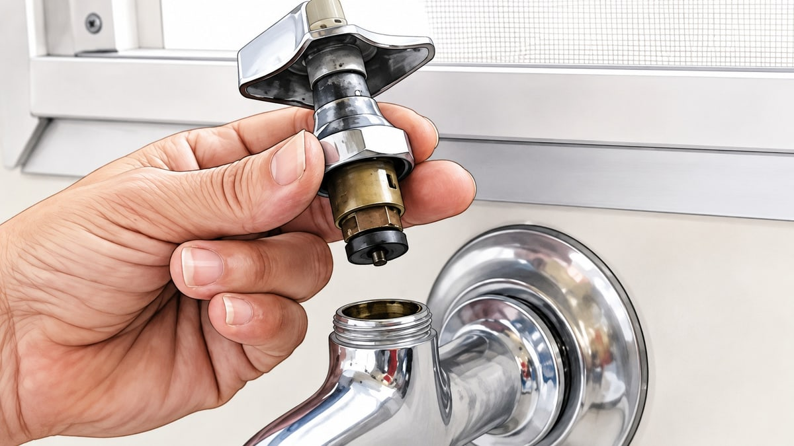
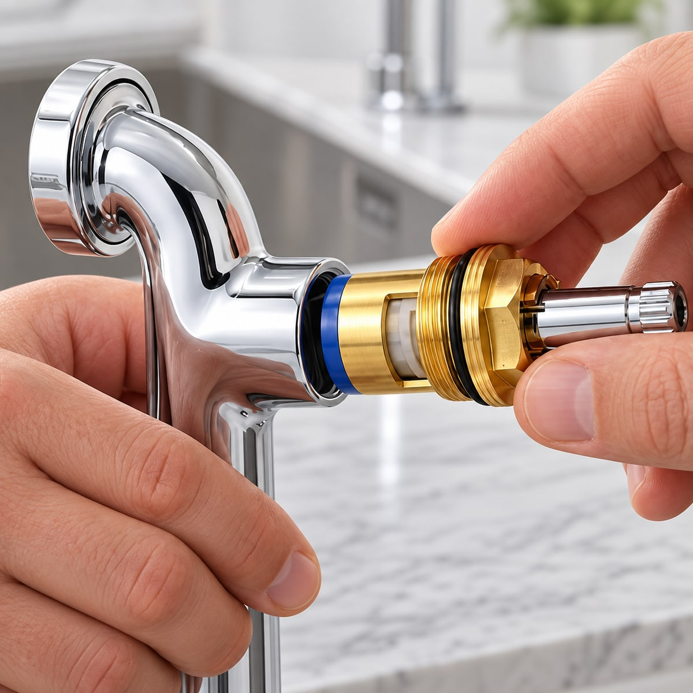

Aquele pinga-pinga que não some nem com o registro fechado até o talo costuma ter um culpado bem menor do que parece. Na maioria das torneiras que vazam, o problema não está na torneira em si — está numa peça pequena escondida por dentro dela, chamada de **reparo** (ou vedante). É essa peça, de borracha ou de cerâmica, que realmente veda a passagem da água. Quando ela gasta, a torneira pinga mesmo estando "boa" por fora.

A boa notícia: o reparo custa poucos reais, e trocar ele é bem mais simples — e mais barato — do que trocar a torneira inteira. Este post é sobre isso: abrir a torneira que você já tem, achar essa peça e trocar só ela. 🚿

> Se você já decidiu que o melhor caminho é trocar a torneira em vez de consertar, o post certo pra você é [Como trocar uma torneira que está pingando](/posts/como-trocar-uma-torneira-que-esta-pingando). Aqui a ideia é outra: recuperar a torneira que você já tem, consertando ela por dentro.

## Resposta rápida: dá pra saber antes de abrir a torneira?

Dá, com bastante segurança:

- **Pinga pelo bico, com a torneira fechada** → quase sempre é o reparo (ou o cartucho, em torneira monocomando). Siga neste post.
- **Vaza pela base do manípulo, só quando a torneira está aberta** → o vedante gasto é outro, o da haste — tem uma seção só sobre isso mais à frente.
- **A torneira tem mais de 10-15 anos, o metal está manchado, opaco ou com corrosão visível, ou você já trocou o reparo e ela continua pingando** → o desgaste pode já ter passado da peça e chegado no corpo da torneira. Nesse caso, trocar o reparo não resolve — veja a seção "quando trocar a torneira inteira", mais adiante.

## Os dois tipos de reparo — e por que isso importa antes de sair comprando

Nem toda torneira usa a mesma peça por dentro, e é aqui que muita gente erra na hora de comprar:

**Torneira de rosca** (aquela que você gira várias voltas pra abrir e fechar) usa um **courinho** — um discozinho de borracha ou plástico preso na ponta de uma haste rosqueada, chamada de **castelo**. É o tipo mais comum em torneiras de pia, tanque e área de serviço mais antigas.

**Torneira monocomando** (a de alavanca única, que sobe/desce e gira de um lado a outro) normalmente usa um **cartucho cerâmico** — dois discos de cerâmica muito lisos que deslizam um sobre o outro. Não existe "courinho" nesse tipo: quando risca ou desgasta, troca-se o cartucho inteiro, não uma peça dele.

Misturar os dois na hora de comprar é o erro mais comum. O jeito mais seguro de acertar de primeira é **levar a peça velha na loja** (ou, no mínimo, tirar uma foto de perto) — existem dezenas de variações de rosca e encaixe entre marcas, mesmo em torneiras parecidas por fora.

## O que você vai precisar

- **Chave de fenda** — para abrir a tampinha decorativa e o parafuso do manípulo
- **Chave inglesa ajustável** (ou uma chave de boca do tamanho certo) — para soltar o castelo ou o cartucho
- **O reparo ou cartucho novo, compatível com o modelo da sua torneira** — a peça que realmente resolve
- **Pano velho** e um **balde ou bacia pequena** — sempre escorre um pouco de água
- Opcional: um pouco de **graxa de silicone ou vaselina em pasta**, para lubrificar o encaixe na hora de remontar

## Passo a passo: como trocar o reparo da torneira

### Passo 1: feche o registro

Feche o registro daquele ponto (geralmente embaixo da pia) — ou o registro geral da casa, se não encontrar um específico ali. Depois de fechado, abra a torneira só pra confirmar que não sai mais água, ou que sai apenas o restinho que ficou no cano.

Deixe o pano e o balde por perto antes de começar. Mesmo com o registro fechado, sempre sobra um pouco de água na peça.

### Passo 2: retire o manípulo

Veja se há uma tampinha decorativa no topo ou na lateral do manípulo — às vezes com o símbolo de quente/frio, às vezes lisa. Ela costuma sair com a unha ou com a ponta da chave de fenda.

Embaixo dela tem um parafuso: solte com a chave de fenda e puxe o manípulo pra fora.

### Passo 3: solte o castelo (ou o cartucho)

Com o manípulo fora, aparece uma peça sextavada ou rosqueada — o **castelo**, em torneira de rosca, ou o corpo do **cartucho**, em monocomando. Use a chave inglesa pra girar no sentido anti-horário e soltar.

Vá com calma aqui: essa peça costuma estar endurecida por anos de uso, e forçar demais pode trincar o corpo da torneira — que é justamente um dos motivos que fazem uma torneira precisar ser trocada inteira mais cedo.

### Passo 4: identifique e troque o reparo

Na ponta do castelo você vai ver o reparo: um discozinho de borracha, geralmente preso por um parafusinho pequeno. Solte esse parafuso, retire o reparo velho e compare tamanho e formato com o novo antes de instalar — é comum errar por um detalhe pequeno de encaixe.

Se for cartucho cerâmico, a troca é mais direta: o cartucho sai inteiro e entra outro no lugar, sem parafuso interno pra soltar.

### Passo 5: já que está aberta, confira o anel de vedação

Enquanto a torneira está desmontada, olhe o **anel de vedação (o-ring)** ao redor do castelo ou do cartucho — um aro de borracha fininho. Se estiver ressecado, achatado ou com uma trinca, ele é o próximo a vazar mesmo com o reparo novo instalado, e vale a pena trocar junto, já que a torneira está aberta mesmo.

### Passo 6: remonte e teste

Recoloque o castelo (ou o cartucho) girando no sentido horário até firmar, sem forçar no final. Reinstale o manípulo, aperte o parafuso e encaixe a tampinha decorativa de volta no lugar.

Abra o registro devagar e observe o bico por uns 30 segundos:

- **Parou de pingar?** Serviço feito.
- **Ainda pinga, mesmo com o reparo novo?** O problema pode estar na sede da torneira, não na peça — veja a seção seguinte.

## Vazamento na base do manípulo, não no bico

Se a água escorre pela base do manípulo enquanto a torneira está aberta — e não pelo bico depois de fechada — o vedante gasto não é o reparo, é o **anel de vedação da haste** (o mesmo o-ring do passo 5). A troca segue o mesmo caminho: fecha o registro, retira o manípulo, troca o anel que está ali, remonta. Trocar o reparo da ponta, nesse caso, não resolve esse tipo específico de vazamento.

## Quando o reparo não resolve — e a torneira inteira precisa ser trocada

Trocar o reparo resolve a grande maioria dos casos, mas não todos. Vale partir para a troca completa quando:

- Você já trocou o reparo (ou o cartucho) e o vazamento continua do mesmo jeito;
- A **sede** da torneira — o assento metálico onde o reparo encosta — está riscada, corroída ou com rebarba visível. Reparo novo encostando numa sede gasta continua vazando;
- A **rosca** de fixação está gasta, trincada ou não firma mais direito;
- O corpo da torneira está trincado, muito oxidado ou vazando por outro ponto além do bico e do manípulo;
- A torneira é muito antiga e o modelo do reparo já nem é mais fácil de encontrar.

Nesses casos, o [post sobre como trocar a torneira inteira](/posts/como-trocar-uma-torneira-que-esta-pingando) explica o passo a passo da substituição completa.

## Quando chamar um profissional

Trocar o reparo é um serviço tranquilo, mas alguns sinais pedem uma parada:

- O registro não fecha direito, ou continua saindo água mesmo fechado — nesse caso o problema está antes da torneira, e mexer sem conseguir isolar a água pode virar um estrago maior;
- A torneira ou a tubulação embutida na parede está soltando água pela alvenaria, não pelo ponto da torneira em si;
- Você sentiu o cano ou a torneira "amolecendo" ou trincando ao tentar soltar — nesse momento, pare, porque forçar pode quebrar a tubulação embutida na parede.

Nesses casos, chamar um encanador custa bem menos do que consertar uma parede ou um cano rompido depois.

## A dica extra

Guarde o reparo velho (ou tire uma foto antes de descartar) mesmo depois de resolvido o problema — na próxima vez que outra torneira da casa começar a pingar, você já sabe comparar o tamanho na loja sem precisar desmontar tudo de novo pra descobrir o modelo.

---

**Resumo rápido:** feche o registro, retire o manípulo, solte o castelo ou o cartucho, troque o reparo (e o anel de vedação, se estiver gasto), remonte e teste. Se mesmo com o reparo novo a torneira continuar pingando, o problema provavelmente é a sede ou a rosca — e aí sim é hora de trocar a torneira inteira.
